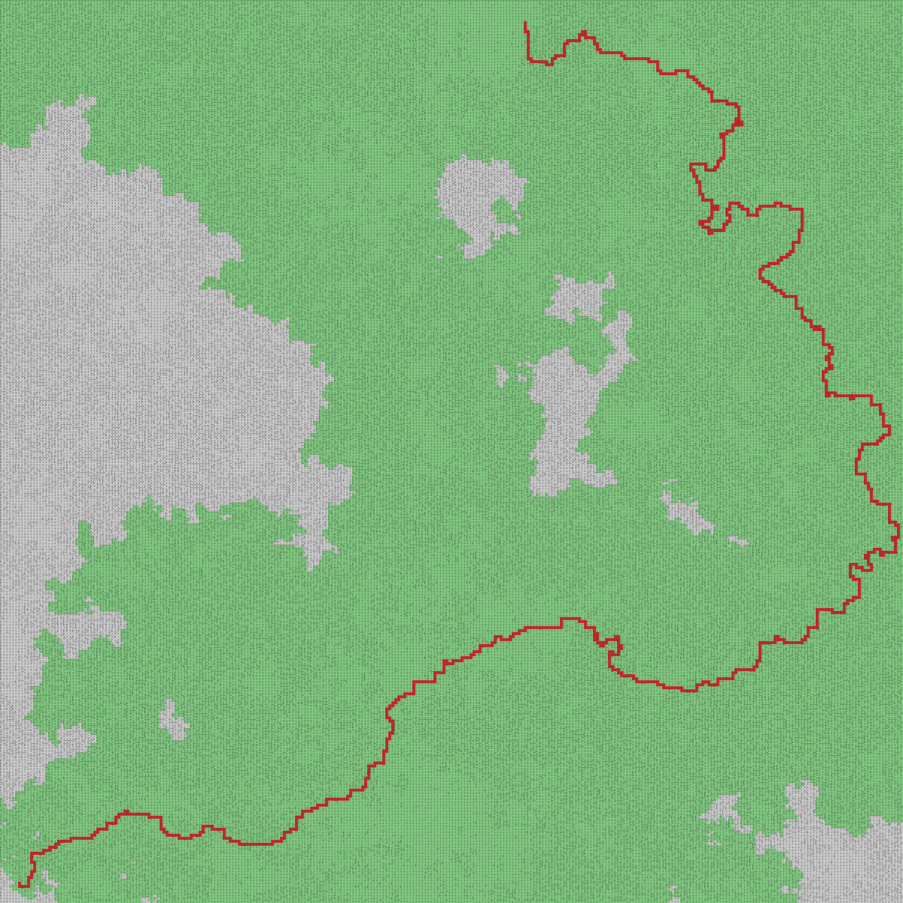

# QuadientEvents competition No.1

This repo was created for a competittion in #QuadientEvents. The project was built by [Go programming language](https://golang.org/) because Go makes very easy building reliable, and efficient programs.

## program usage
The program fetches a task from the remote server, runs finding algorithm and try to answer by default. There is some flags which can be used during launching program and do some more things.

* **-b** *(benchmark)* - launches the program and watchs durations to finding paths
* **-v** *(visualization)* - launches the program and after finding the shortest path creates an image with a result - *in format {TaskId}.png*

## basic structure of program
* **api** - contains a code useful for a connection with the remote server for fetching and submitting a task
* **core** - contains a core algorithm for finding the shortest path and other utils
* **model** - represents a data which are returned from the remote server
* **visual** - contains a code for graphical representation of a result

## core modul
Finding the shortest path is implemented by the [A*](https://en.wikipedia.org/wiki/A*_search_algorithm) algorithm. This algorithm is more efficient than the Dijkstra the algorithm because algorithm includes a heuristic metric. The heuristic metric adds another evaluation which represents a distance between a current and a finish node to the algorithm.
[Manhattan distance](https://en.wiktionary.org/wiki/Manhattan_distance) was choosen as the heuristic function because the area matrix of task contains only orthogonaly paths.
For the best performance was created a priority queue. This priority queue is implemented by [Fibonacci heap](https://en.wikipedia.org/wiki/Fibonacci_heap) because its asymptotic complexity is very low.
Another performance optimalization may be in usages [goroutines](https://tour.golang.org/concurrency/1) but I had not enough time to implement it.

All code is well tested. The test coverage is 91.7%. Rest of the application is not neccesary to test because I would test behaviour of Go inner lib.

I would like to stress point 3 *(Structuring and clean code)* from criterions. In spite of possibility code can be little confusing, this code is written according to Go specifications and recommendations :).

## benchmark
Computer specification:

* **OS** - macOS Sierra v10.12.6
* **CPU** - 2,9 GHz Intel Core i5
* **MEM** - 8 GB 2133 MHz LPDDR3

The average time was calculated just from 10 attempts due to the remote server.
* So, the average time of algorithm in 10 attempts was: **247 ms**
* the best attempt: **115 ms**
* the worst attempt: **481 ms**

## example of result image
* **gray** - cell did not processed
* **green** - cell was processed
* **red** - cell is part of found path

